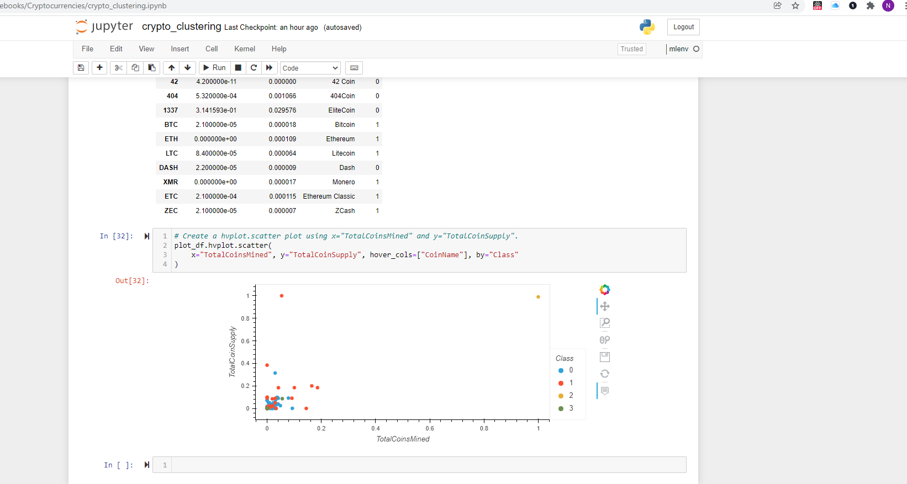

# Project Name: Cryptocurrencies

#  Project Sponsor:  ABC Investment Bank

#  Project Manager: Nayan Patel

# Scope:

 ABC Investment Bank is interested in offering a new cryptocurrency investment portfolio for its customers. The company, however, is lost in the vast universe of cryptocurrencies. So, they’ve asked to create a report that includes what cryptocurrencies are on the trading market and how they could be grouped to create a classification system for this new investment.

# Resources:

 1. Python - machine learning models. Since there is no known output for what company is looking for, We have decided to use unsupervised learning. To group the cryptocurrencies, with clustering algorithm. We’ll use data visualizations to share findings with the board.

 2. Crypto Currency Data

# Deliverables:

Deliverable 1: Preprocessing the Data for PCA

Deliverable 2: Reducing Data Dimensions Using PCA

Deliverable 3: Clustering Cryptocurrencies Using K-means

Deliverable 4: Visualizing Cryptocurrencies Results

# Deliverable 1: Preprocessing the Data for PCA

1. Retrive The crypto_data.csv 

2. Keep all the cryptocurrencies that are being traded.

3. Drop the IsTrading column.

4. Remove rows that have at least one null value.

5. Filter the crypto_df DataFrame so it only has rows where coins have been mined.

6. Create a new DataFrame that holds only the cryptocurrency names, and use the crypto_df DataFrame index as the index for this new DataFrame.

7. Remove the CoinName column from the crypto_df DataFrame since it's not going to be used on the clustering algorithm.
   
8. Here is result for crypto_df

# Deliverable 2: Reducing Data Dimensions Using PCA

1. Using the crypto_clustering.ipynb file from Deliverable 1 
apply PCA to reduce the dimensions to three principal components.

2. Create a new DataFrame named pcs_df that includes the following columns, PC 1, PC 2, and PC 3, and uses the index of the crypto_df DataFrame as the index.

# Deliverable 3: Clustering Cryptocurrencies Using K-means

1. 
   

2. 

3. 
   
Creating elbow curve   

# 4. Deliverable 4: Visualizing Cryptocurrencies Results

# Summary:

created a report that includes what cryptocurrencies are on the trading market and how they could be grouped to create a classification system for this new investment.

Since there is no lnown output we have decided to use unsupervised learning. 

To group the cryptocurrencies, we are using clustering algorithm and data visualizations to share findings with the board and provides details on cryptocurrencies which are on the market and how they can help create a database for curriencies and classification for a new crypto.

To process data, how to cluster, how to reduce your dimensions, and how to reduce the principal components using PCA. 

